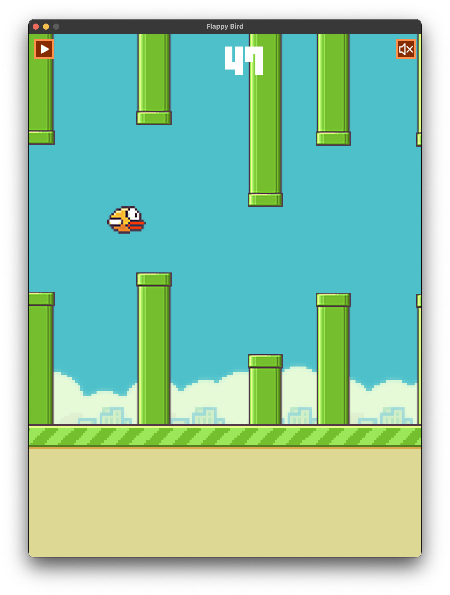

# Flappy Bird

## Introduction
Recreation of the classic _Flappy Bird_ game, written in C++ and implementing the SFML 2.5.1 library. 
This simple yet addictive game allows you to control a bird as it navigates through pipes. 
The objective of the game is to keep the bird flying and avoid hitting the pipes to achieve the highest score 
possible. You will earn medals towards the end depending on your scores! 

## Pre-requisites
* C++11
* Cmake
* SFML 2.5.1 Library

## Installation
1. ### SFML
* **Linux (Debian)**
```bash
sudo apt-get install libsfml-dev
```

* **MacOS**
(Install Homebrew if **_brew_** not recognized)
```zsh
brew install sfml
```
Also disregard the shared_ptr issues with clangd. These have no effect on how the application runs.

* **Windows** \
Install SFML dependency \
Build and run .exe file. (Not tested on Windows)

2. ### Clone & Build
```bash
git clone https://github.com/sudfish/Flappy-Bird.git
cd Flappy-Bird && mkdir build/
chmod u+x run.sh
./run.sh
```
**run.sh** is a bash script designed to compile the project and include the SFML library.

## Snapshots



## License
Standard MIT license. Feel free to modify as you please.

## Author
Created by [@sudfish](https://github.com/sudfish)
